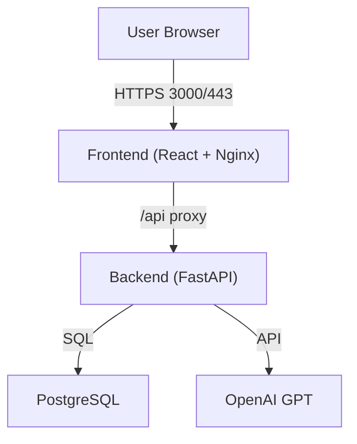

# v2v: Chat Session App (FastAPI + React + OpenAI)

## Overview

**v2v** is a full-stack, containerized web application for managing chat sessions powered by OpenAI's GPT models. It features a FastAPI backend, a React (TypeScript, Vite) frontend, PostgreSQL for persistence, and is orchestrated with Docker Compose for easy deployment.

---

## Architecture



---

## Prerequisites
- [Docker](https://www.docker.com/)
- [Docker Compose](https://docs.docker.com/compose/)
- OpenAI API key (for chat functionality)

---

## Quickstart

1. **Clone the repository:**
   ```sh
   git clone <your-repo-url>
   cd v2v
   ```
2. **Set your OpenAI API key:**
   - Create a `.env` file or set the environment variable `OPENAI_API_KEY` in your shell.
3. **Start all services:**
   ```sh
   docker-compose up --build
   ```
4. **Access the app:**
   - Frontend: [https://localhost:3000](https://localhost:3000) (self-signed cert in dev)
   - API: [http://localhost:8000/docs](http://localhost:8000/docs) (internal, via backend container)

---

## Environment Variables
- `OPENAI_API_KEY` (required for backend)
- `DATABASE_URL` (optional, defaults to local SQLite for dev; overridden in Docker Compose for Postgres)

---

## Directory Structure
```
v2v/
  backend/      # FastAPI app, DB models, Alembic migrations, Dockerfile
  frontend/     # React app (Vite), Nginx config, Dockerfile
  docker-compose.yml
```

---

## Backend
- **Framework:** FastAPI
- **DB:** SQLAlchemy models, Alembic migrations, PostgreSQL (default in Docker)
- **Endpoints:** `/api/session`, `/api/chat`, `/api/gpt`, etc.
- **OpenAI:** Requires API key for GPT chat
- **Dev server:** `uvicorn app.main:app --reload`
- **Dependencies:** See `backend/requirements.txt`

## Frontend
- **Framework:** React + TypeScript + Vite
- **Served by:** Nginx (with HTTPS, self-signed in dev)
- **API Proxy:** `/api` proxied to backend
- **Dev server:** `npm run dev` (see `frontend/README.md` for advanced dev info)
- **Dependencies:** See `frontend/package.json`

---

## Development
- **Local dev:**
  - Backend: `cd backend && uvicorn app.main:app --reload`
  - Frontend: `cd frontend && npm install && npm run dev`
  - Set `OPENAI_API_KEY` in your environment
- **Migrations:**
  - `cd backend && alembic revision --autogenerate -m "message" && alembic upgrade head`

---

## License
MIT (or specify your license)

---

## Credits
- [FastAPI](https://fastapi.tiangolo.com/)
- [React](https://react.dev/)
- [Vite](https://vitejs.dev/)
- [OpenAI](https://openai.com/) 